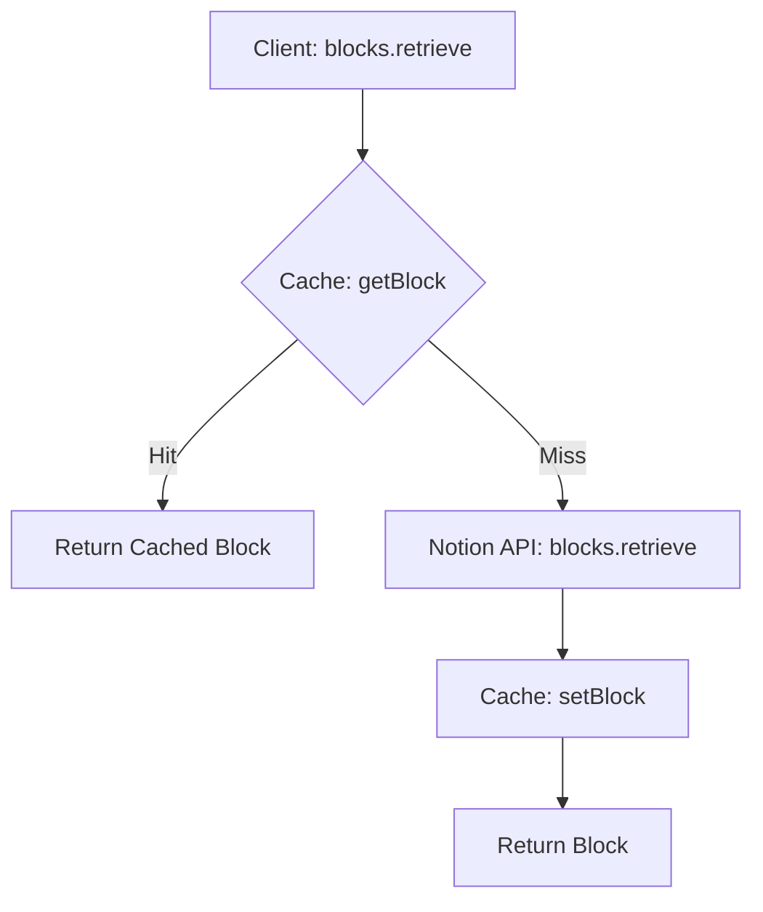
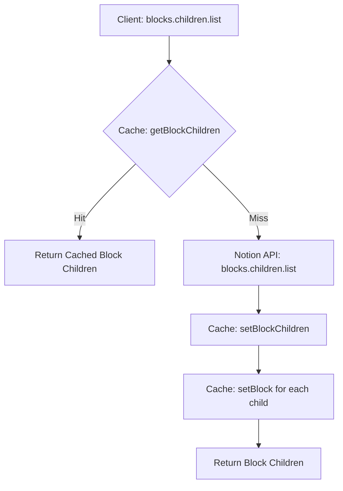
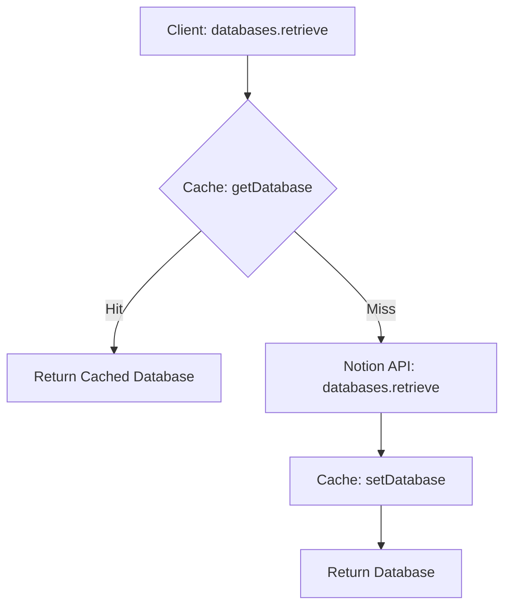
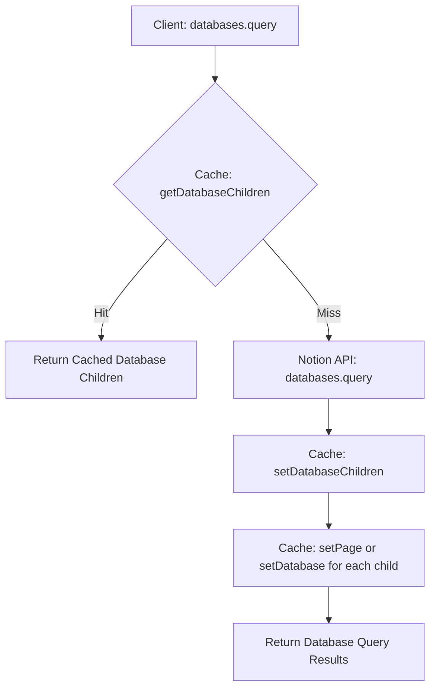
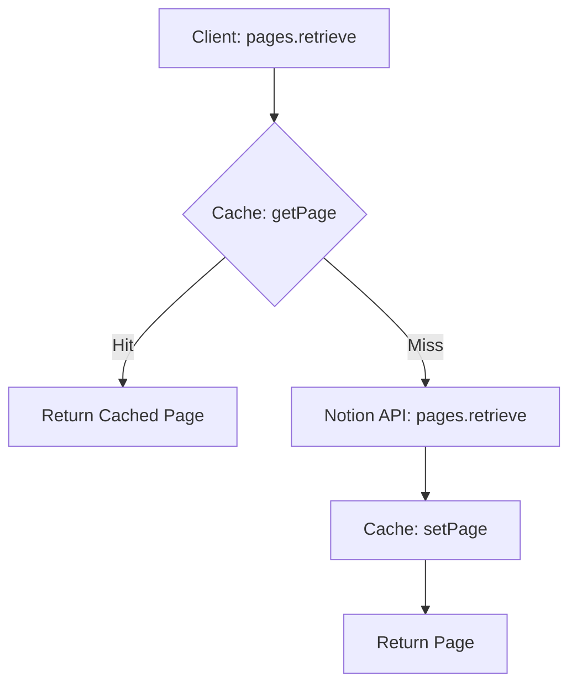

# Notion Cache Client

A Notion client that can cache queries for improved performance and reduced API calls.

## Features

- Caches Notion API responses for blocks, pages, databases, and their children
- Automatically refreshes cache when content is updated
- Reduces API calls by serving cached data when available
- Supports persistent cache storage

## Installation

```bash
npm install notion-cache-client
```

## Usage

```typescript
import { NotionCacheClient } from "notion-cache-client"

const client = new NotionCacheClient({
  auth: "your-notion-api-key",
  cacheOptions: {
    cacheDirectory: "./.cache", // Optional: specify a cache directory
  },
})
// Use the client to make Notion API calls
const page = await client.pages.retrieve({ page_id: "your-page-id" })
```

## API

The `NotionCacheClient` extends the official Notion client and provides the same API with caching capabilities. Some key methods include:

- `blocks.retrieve()`
- `blocks.children.list()`
- `pages.retrieve()`
- `databases.retrieve()`
- `databases.query()`

For full API documentation, refer to the [official Notion API docs](https://developers.notion.com/reference/intro).

## Cache Management

The cache is automatically managed, but you can also control it manually:

```typescript
// Clear the entire cache
await client.cache.clearCache()
// Save the current cache to disk
await client.cache.saveCache()
// Load the cache from disk
await client.cache.loadCache()
```

## Configuration

You can configure the cache behavior when initializing the client:

```typescript
const client = new NotionCacheClient({
  auth: "your-notion-api-key",
  cacheOptions: {
    cacheDirectory: "./.cache",
    // Add other cache options here
  },
})
```

# Cache Objects

The Notion Cache Client stores various types of objects to enhance performance and minimize API calls. These cache objects correspond to the primary resources provided by the [Notion API](https://developers.notion.com/docs). Below is an overview of each cache type along with references to the relevant API endpoints.

## 1. Block Objects Cache

**Description:**  
Stores individual block objects retrieved from Notion. Blocks are the fundamental units of content in Notion, such as paragraphs, headings, images, and more.

**API Reference:**

- [Retrieve a Block](https://developers.notion.com/reference/retrieve-a-block)
- [Block Reference](https://developers.notion.com/reference/block)

## 2. Page Objects Cache

**Description:**  
Stores page objects retrieved from Notion. Pages in Notion can contain blocks and serve as containers for various types of content.

**API Reference:**

- [Retrieve a Page](https://developers.notion.com/reference/retrieve-a-page)
- [Page Reference](https://developers.notion.com/reference/page)

## 3. Database Objects Cache

**Description:**  
Stores database objects retrieved from Notion. Databases in Notion allow for structured data management with properties and entries.

**API Reference:**

- [Retrieve a Database](https://developers.notion.com/reference/retrieve-a-database)
- [Database Reference](https://developers.notion.com/reference/database)

## 4. Block Children Cache

**Description:**  
Stores the children of block objects, which are retrieved using the block children endpoints. This includes any nested blocks within a parent block.

**API Reference:**

- [Get Block Children](https://developers.notion.com/reference/get-block-children)

## 5. Database Children Cache

**Description:**  
Stores the results of database queries, including the children entries of a database. This cache helps in quickly accessing database records without making repeated API calls.

**API Reference:**

- [Query a Database](https://developers.notion.com/reference/post-database-query)

## Operations

### 1. Block Retrieval and Caching:



### 2. Block Children Retrieval and Caching:



### 3. Database Retrieval and Caching:



### 4. Database Query and Caching:



### 5. Page Retrieval and Caching:



## Contributing

Contributions are welcome! Please feel free to submit a Pull Request.

## License

This project is licensed under the MIT License.
